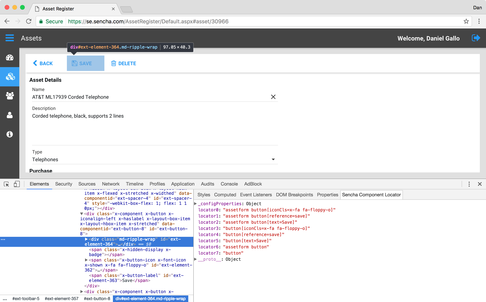
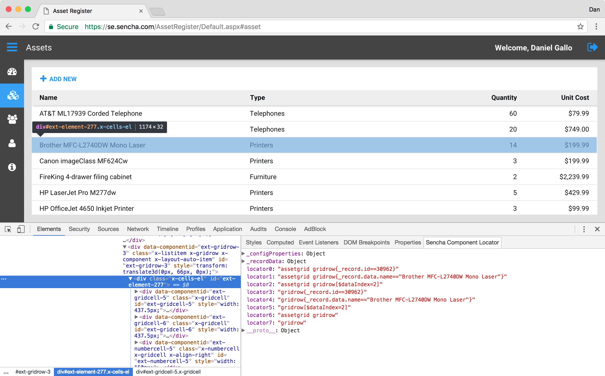

# Sencha Component Locator

An extension for Google Chrome that helps suggest valid locators for Ext JS components from selected elements.

Available in the [Chrome Web Store](https://chrome.google.com/webstore/detail/sencha-component-locator/facapfmceabacjkjhjfjoaimoopiakdl).

## Screenshots

### Inspecting a Button

### Inspecting a Grid

