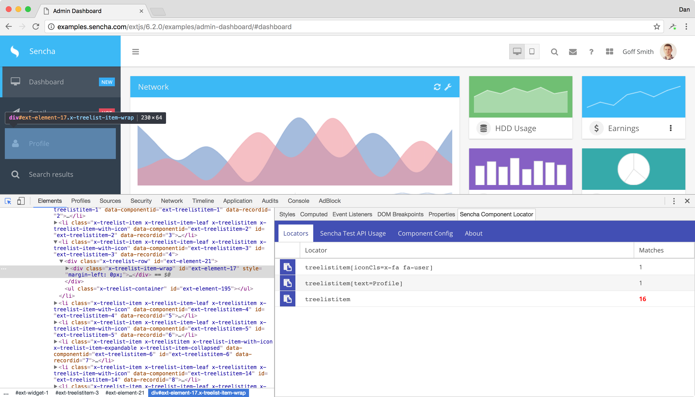
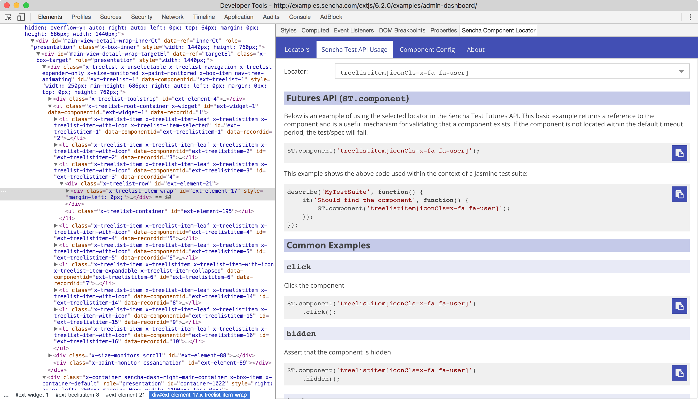
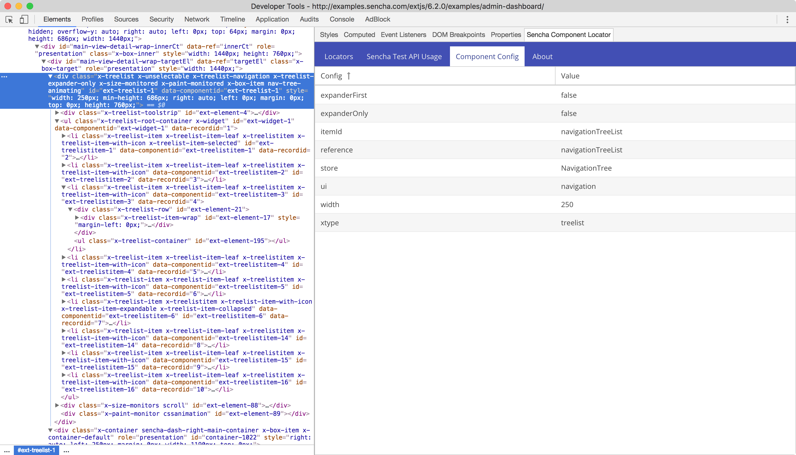

# Sencha Component Locator

An extension for Google Chrome that helps suggest valid locators for Ext JS components from selected elements, along 
with examples of how to use those locators within the Sencha Test Futures API.

Available in the [Chrome Web Store](https://chrome.google.com/webstore/detail/sencha-component-locator/facapfmceabacjkjhjfjoaimoopiakdl).

## Screenshots

### Inspecting a Treelist Item

### Shows example usage of Sencha Test Futures API

### Viewing the Component's config values

